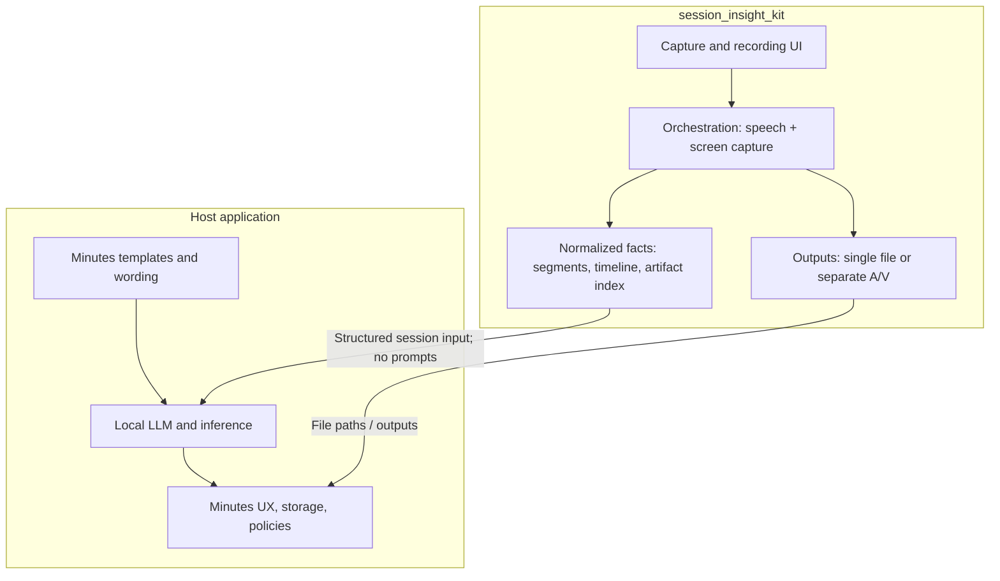
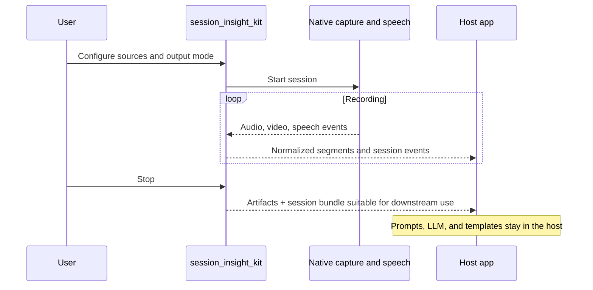
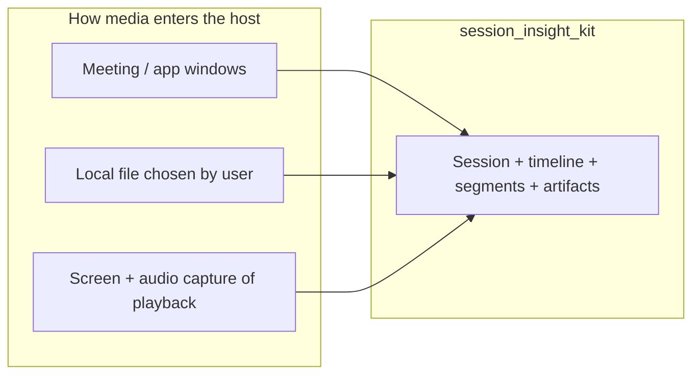

# session_insight_kit

Flutter widgets and orchestration for **macOS meeting-style capture**: choose **which display or window** to record and **which audio path** to use, see **clear recording state**, and emit **normalized session data** for your app. The package is designed to integrate with [`speech_kit`](https://github.com/blendfactory/speech-kit) and [`screen_capture_kit`](https://github.com/blendfactory/screen-capture-kit).

**It does not run local LLMs, ship prompt templates, or generate “insights.”** The host application owns instructions, minutes templates, model choice, and any summarization. This package focuses on **facts**: capture UI, session lifecycle, outputs, and structured **downstream-ready** payloads (timestamps, segments, artifact metadata).

---

## At a glance

| In scope | Out of scope |
|----------|----------------|
| macOS capture and recording UX | Invoking or bundling a local LLM |
| Source selection (display, window, audio routes within API limits) | Prompt text, few-shot examples, minutes templates as package defaults |
| Obvious “now recording” affordances | Fetching third-party streams by URL (e.g. YouTube) inside the package |
| Multiplexed **or** demuxed outputs (host-selectable) | Legal/compliance decisions about recording |
| Normalized transcript segments + session bundle for **your** pipelines | Product analytics telemetry by default |

---

## Architecture: package vs host

---

## Session data flow

---

## Content origins (same session model)

Meetings, **local media files**, or **screen capture of playback** (e.g. browser video) can all map into one session model. **How** media is obtained (disk picker, your own URL handling, or capturing the screen) stays in the **host**; this package does **not** download or embed players for third-party URLs.

---

## Analysis foundation (included)

The package aims to provide a **stable factual layer** for analytics and LLM pipelines without performing analysis itself:

- **Provenance**: capture kind, resolution, display or window identity where applicable, session timing.
- **Timeline**: a consistent time base for transcript segments and session events (including mapping you can use to align text to media).
- **Transcript normalization**: structured segments (e.g. text, start/end offsets, confidence when available).
- **Artifact catalog**: paths (and optional checksums) for multiplexed or demuxed outputs.
- **Session events**: start/stop, errors, source changes—useful for replay and dashboards in the host.

These are **not** prompts; they are **inputs your app serializes** or passes to a local LLM on your terms.

---

## Platform

- **macOS only** (desktop capture and permissions model).

---

## Getting started

Dependencies and public API surface are still evolving. Add this package to your `pubspec.yaml` once versions and integration points are published, then follow the `/example` app (to be added).

---

## Additional information

- **Repository**: [github.com/blendfactory/session-insight-kit](https://github.com/blendfactory/session-insight-kit)
- **Issues**: [github.com/blendfactory/session-insight-kit/issues](https://github.com/blendfactory/session-insight-kit/issues)

For general Flutter package development, see [creating packages](https://dart.dev/guides/libraries/creating-packages) and [developing packages and plugins](https://flutter.dev/to/develop-packages).
